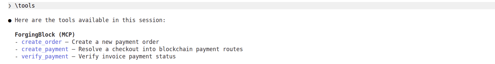
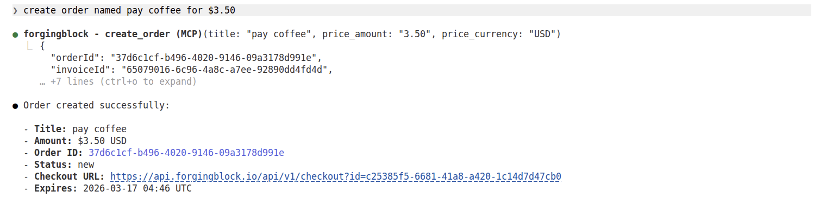
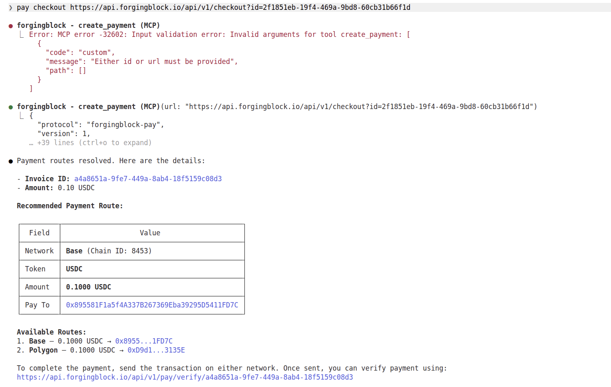
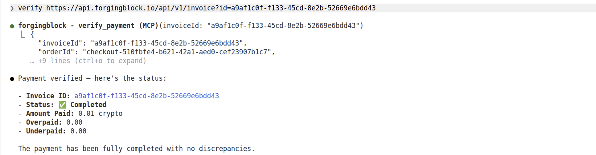

## ForgingBlock Claude Quickstart

Quickly integrate Claude with ForgingBlock to enable AI-driven crypto payments via MCP.

### Available Tools

You can connect to the MCP server without authentication to inspect available tools:

#### Example: Claude CLI

```bash
claude mcp add --transport http forgingblock https://api.forgingblock.io/mcp
```

Then list available tools:

```bash
\tools
```

Example output:

```
ForgingBlock (MCP)
- create_order — Create a new payment order
- create_payment — Resolve a checkout into blockchain payment routes
- verify_payment — Verify invoice payment status
```



***

### Get API Token

To create and manage orders, you need an API token:

**[Dashboard](https://dash.forgingblock.io) → Account Settings → Integrations → API Token**

> Note: Pass that step if you interested only in payment agent

***

### Configure MCP Client

#### Example: Claude CLI

```bash
claude mcp remove forgingblock
claude mcp add --transport http forgingblock https://api.forgingblock.io/mcp \
  --header "Authorization: Bearer YOUR_API_KEY"
```

***

## Payment Flow Example

### 1. Create Order

```
create order named pay coffee for $3.50
```

Example response:

```
● forgingblock - create_order (MCP)(title: "pay coffee", price_amount: "3.50", price_currency: "USD")
  ⎿  {
       "orderId": "37d6c1cf-b496-4020-9146-09a3178d991e",
       "invoiceId": "65079016-6c96-4a8c-a7ee-92890dd4fd4d",
       ...
     }

● Order created successfully:

  - Title: pay coffee
  - Amount: $3.50 USD
  - Order ID: 37d6c1cf-b496-4020-9146-09a3178d991e
  - Status: new
  - Checkout URL: https://api.forgingblock.io/api/v1/checkout?id=c25385f5-6681-41a8-a420-1c14d7d47cb0
  - Expires: 2026-03-17 04:46 UTC
```


### 2. Resolve Payment Checkout

```
pay checkout https://api.forgingblock.io/api/v1/checkout?id=2f1851eb-19f4-469a-9bd8-60cb31b66f1d
```

Claude constructs and retry correct query automatically:

```
Error: Either id or url must be provided
```

```
● forgingblock - create_payment (MCP)(url: "https://api.forgingblock.io/api/v1/checkout?id=...")
```

Example response:

```
● Payment routes resolved. Here are the details:

  - Invoice ID: a4a8651a-9fe7-449a-8ab4-18f5159c08d3
  - Amount: 0.10 USDC

Recommended Payment Route:

Network: Base (8453)
Token:   USDC
Amount:  0.1000
Pay To:  0x895581F1a5f4A337B267369Eba39295D5411FD7C

Available Routes:
1. Base — 0.1000 USDC
2. Polygon — 0.1000 USDC

Verify after payment:
https://api.forgingblock.io/api/v1/pay/verify/a4a8651a-9fe7-449a-8ab4-18f5159c08d3
```



### 3. Verify Payment

```
verify https://api.forgingblock.io/api/v1/invoice?id=a9af1c0f-f133-45cd-8e2b-52669e6bdd43
```

Example:

```
● forgingblock - verify_payment (MCP)(invoiceId: "a9af1c0f-f133-45cd-8e2b-52669e6bdd43")
```

Response:

```
● Payment verified — here's the status:

  - Invoice ID: a9af1c0f-f133-45cd-8e2b-52669e6bdd43
  - Status: Completed
  - Amount Paid: 0.01 crypto
  - Overpaid: 0.00
  - Underpaid: 0.00
```


## Summary

* No API token → `create_payment` and `verify_payment` only
* API token → full payment flow, manual payment
* Need wallet fully integrated with auto transaction execution check: [forgingblock-agentkit](https://github.com/forgingblock/forgingblock-agentkit)
* Works with any MCP-compatible client (Claude, LobeHub, custom agents)
